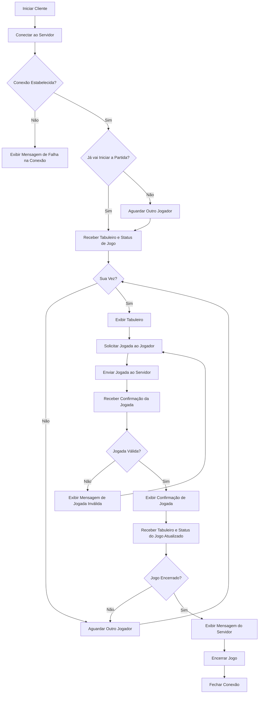

# Documentação do Projeto

```mermaid
flowchart TD
    A[Iniciar Cliente] --> B[Conectar ao Servidor]
    B --> C{Conexão Estabelecida?}
    C -- Não --> D[Exibir Mensagem de Falha na Conexão]
    C -- Sim --> E{Já vai Iniciar a Partida?}
    E -- Sim --> G[Receber Tabuleiro e Status de Jogo]
    E -- Não --> F[Aguardar Outro Jogador]
    F --> G
    G --> H{Sua Vez?}
    H -- Não --> I[Aguardar Outro Jogador]
    I --> H
    H -- Sim --> J[Exibir Tabuleiro]
    J --> K[Solicitar Jogada ao Jogador]
    K --> L[Enviar Jogada ao Servidor]
    L --> S[Receber Confirmação da Jogada]
    S --> M{Jogada Válida?}
    M -- Não --> N[Exibir Mensagem de Jogada Inválida]
    N --> K
    M -- Sim --> O[Exibir Confirmação de Jogada]
    O --> P[Receber Tabuleiro e Status do Jogo Atualizado]
    P --> Q{Jogo Encerrado?}
    Q -- Não --> I
    Q -- Sim --> R[Exibir Mensagem do Servidor]
    R --> U[Encerrar Jogo]
    U --> V[Fechar Conexão]
```
