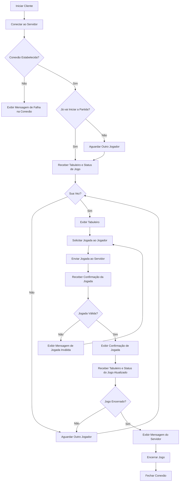

# Projeto Jogo da Velha
Nesse Projeto foi desenvolvido uma aplicação cliente compatível com o [Servidor](https://github.com/Hoffmann365/avaliacao_redes/blob/main/Jogo%20da%20Velha/TicTacToeServer/TicTacToeServer/Program.cs) apresentado para o Jogo da Velha.

### No Projeto consta:
- Relatório contendo:
  - Fluxograma para a aplicação cliente;
  - Descrição do código-fonte correspondente a cada bloco do diagrama;
- Repositório do GitHub com o código da aplicação desenvolvida.

### Devs do Projeto
- Davi Hoffmann
- Karla Juliane
- Maria Vitória

## Cliente
A Aplicação cliente a seguir [TicTacToeClient](https://github.com/Hoffmann365/avaliacao_redes/blob/main/Jogo%20da%20Velha/TicTacToeClient/TicTacToeClient/Program.cs) acessa o servidor do Jogo da velha e serve tanto para o Jogador 1, quanto para o Jogador 2.

### Características

- O Cliente se conecta ao Servidor com o IP "127.0.0.1" na porta 13000.
- Após o início da partida o cliente recebe e exibe o tabuleiro.
- O jogador na vez irá digitar a jogada e o Cliente envia para o servidor.
- Após cada jogada o Cliente recebe e exibe o tabuleiro atualizado com as jogadas anteriores.
-  Quando a condição de Vitória/Empate for atingida o Cliente manda uma mensagem informando quem ganhou, encerra a conexão com o servidor e encerra a aplicação.

### Fluxograma
O Fluxograma a seguir mostra o funcionamento do Cliente.




### Descrição do Código Fonte

Bibliotecas Utilizadas no Projeto:
```c#
using System;
using System.Net.Sockets;
using System.Text;
```

1. Conexão com o Servidor:

```c#
//Define o IP e a Porta
string server = "127.0.0.1";
int port = 13000;

//Conecta ao Servidor
client = new TcpClient(server, port); 
stream = client.GetStream();

//Mensagem de Confirmação de Conexão
Console.WriteLine("Conectado ao servidor do Jogo da Velha!");
```
Nesse primeiro bloco de código, o Cliente define o IP e a porta do Servidor e realiza a conexão. Após se conectar o Cliente exibe uma mensagem de confirmação de conexão.

2. Espera Pela Conexão dos 2 Jogadores:

```c#
 while (!gameStarted)
{
    //Receber mensagem inicial do servidor (esperando outro jogador ou início do jogo)
    bytesRead = stream.Read(buffer, 0, buffer.Length);
    startMsg = Encoding.UTF8.GetString(buffer, 0, bytesRead).Trim();

    //Se a mensagem for 1 exibe uma mensagem de espera pelo outro Player 
    if (startMsg == "1" && !ignore)
    {
        //Mensagem de espera pelo Jogador 2
        Console.WriteLine("Aguardando outro jogador...");
        //Armazena a informação de que é o Jogador 1 (X)
        playerSymbol = "X";
        ignore = true;
    }
    //Se a mensagem for 0 exibe mensagem de confirmação de Início da Partida
    else if (startMsg == "0")
    {
        //Mensagem de confirmação de Início de Partida
        Console.WriteLine("Iniciando Partida...");
        //Valor padrão de "playerSymbol" é "O"
        gameStarted = true;
    }
}
```

Nesse bloco de código o Cliente recebe uma mensagem do Servidor, a qual se for '1' indica que está aguardando outro jogador e que também que o Cliente é o Jogador 1 ("X"). Caso a mensagem seja '0' indica que o Cliente é o jogador 2 ("O") e que já vai iniciar a partida. 

Se a mensagem for '1' o cliente exibe a mensagem "Aguardando outro Jogador..." , armazena que ele é o jogador 1 e fica aguardando o começo da partida. Se a mensagem for '0' o Cliente exibe uma mensagem de confirmação de início de partida e parte para o próximo bloco de código.

3. Exibição Inicial do Tabuleiro
```c#
// Recebe mensagem do Servidor
bytesRead = stream.Read(buffer, 0, buffer.Length);
response = Encoding.UTF8.GetString(buffer, 0, bytesRead);
            
// Exibe o tabuleiro
ExibirTabuleiro(response);

if (playerSymbol == "O")
{
    control = true;
}
```
**continuar a descrição do código fonte...**