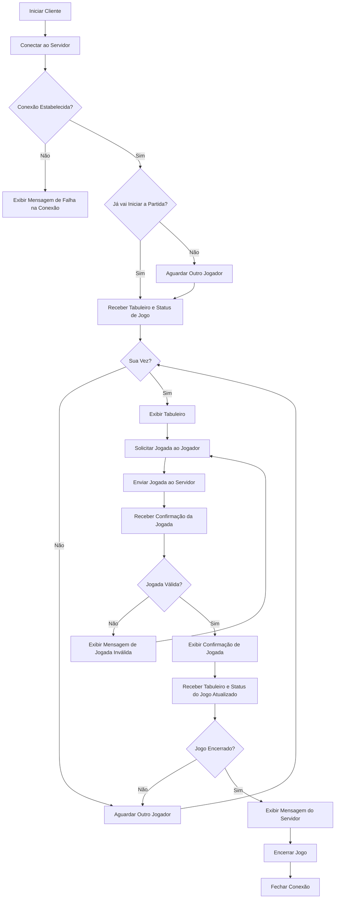

# Projeto Jogo da Velha
Nesse Projeto foi desenvolvido uma aplicação cliente compatível com o [Servidor](https://github.com/Hoffmann365/avaliacao_redes/blob/main/Jogo%20da%20Velha/TicTacToeServer/TicTacToeServer/Program.cs) apresentado para o Jogo da Velha.

### No Projeto consta:
- Relatório contendo:
  - Fluxograma para a aplicação cliente;
  - Descrição do código-fonte correspondente a cada bloco do diagrama;
- Repositório do GitHub com o código da aplicação desenvolvida.

### Devs do Projeto
- Davi Hoffmann
- Karla Juliane
- Maria Vitória

## Cliente
A Aplicação cliente a seguir [TicTacToeClient](https://github.com/Hoffmann365/avaliacao_redes/blob/main/Jogo%20da%20Velha/TicTacToeClient/TicTacToeClient/Program.cs) acessa o servidor do Jogo da velha e serve tanto para o Jogador 1, quanto para o Jogador 2.

### Características

- O Cliente se conecta ao Servidor com o IP "127.0.0.1" na porta 13000.
- Após o início da partida o cliente recebe e exibe o tabuleiro.
- O jogador na vez irá digitar a jogada e o Cliente envia para o servidor.
- Após cada jogada o Cliente recebe e exibe o tabuleiro atualizado com as jogadas anteriores.
-  Quando a condição de Vitória/Empate for atingida o Cliente manda uma mensagem informando quem ganhou, encerra a conexão com o servidor e encerra a aplicação.

### Fluxograma
O Fluxograma a seguir mostra o funcionamento do Cliente.




### Descrição do Código Fonte

Bibliotecas Utilizadas no Projeto:
```c#
using System;
using System.Net.Sockets;
using System.Text;
```

1. Conexão com o Servidor:

```c#
//Define o IP e a Porta
string server = "127.0.0.1";
int port = 13000;

//Conecta ao Servidor
client = new TcpClient(server, port); 
stream = client.GetStream();

//Mensagem de Confirmação de Conexão
Console.WriteLine("Conectado ao servidor do Jogo da Velha!");
```
Nesse primeiro bloco de código, o Cliente define o IP e a porta do Servidor e realiza a conexão. Após se conectar o Cliente exibe uma mensagem de confirmação de conexão.

2. Espera Pela Conexão dos 2 Jogadores:

```c#
 while (!gameStarted)
{
    //Receber mensagem inicial do servidor (esperando outro jogador ou início do jogo)
    bytesRead = stream.Read(buffer, 0, buffer.Length);
    startMsg = Encoding.UTF8.GetString(buffer, 0, bytesRead).Trim();

    //Se a mensagem for 1 exibe uma mensagem de espera pelo outro Player 
    if (startMsg == "1" && !ignore)
    {
        //Mensagem de espera pelo Jogador 2
        Console.WriteLine("Aguardando outro jogador...");
        //Armazena a informação de que é o Jogador 1 (X)
        playerSymbol = "X";
        ignore = true;
    }
    //Se a mensagem for 0 exibe mensagem de confirmação de Início da Partida
    else if (startMsg == "0")
    {
        //Mensagem de confirmação de Início de Partida
        Console.WriteLine("Iniciando Partida...");
        //Valor padrão de "playerSymbol" é "O"
        gameStarted = true;
    }
}
```

Nesse bloco de código o Cliente recebe uma mensagem do Servidor, a qual se for '1' indica que está aguardando outro jogador e que também que o Cliente é o Jogador 1 ("X"). Caso a mensagem seja '0' indica que o Cliente é o jogador 2 ("O") e que já vai iniciar a partida. 

Se a mensagem for '1' o cliente exibe a mensagem "Aguardando outro Jogador..." , armazena que ele é o jogador 1 e fica aguardando o começo da partida. Se a mensagem for '0' o Cliente exibe uma mensagem de confirmação de início de partida e parte para o próximo bloco de código.

3. Exibição Inicial do Tabuleiro
```c#
// Recebe mensagem do Servidor
bytesRead = stream.Read(buffer, 0, buffer.Length);
response = Encoding.UTF8.GetString(buffer, 0, bytesRead);
            
// Exibe o tabuleiro
ExibirTabuleiro(response);
```
Nesse bloco de código o Cliente recebe o tabuleiro do Servidor e o Exibe na tela.

4. Mensagem de Espera de Jogada Adversária
```c#
//Serve para identificação de quem está na vez
if (playerSymbol == "O")
{
    //Serve para acionar a mensagem de espera de Jogada do Oponente
    control = true;
}

 // Loop do jogo
while (!gameEnded)
{
   //Se control for verdadeiro, exibe uma mensagem de espera de Jogada do Oponente
    if (control)
    {
        //Mensagem de espera de Jogada do Oponente
        Console.WriteLine("Aguarde a Jogada do seu oponente...");
    } 
```
Nesse bloco de código, se o cliente for o Jogador 2 ele torna verdadeira uma booleana chamada `control` e se essa variável for verdadeira ele exibe uma mensagem de espera da jogada do Oponente dentro do loop do jogo.

5. Loop de Jogo
```c#
// Loop do jogo
while (!gameEnded)
{
    //Se control for verdadeiro, exibe uma mensagem de espera de Jogada do Oponente
    if (control)
    {
        //Mensagem de espera de Jogada do Oponente
        Console.WriteLine("Aguarde a Jogada do seu oponente...");
    }
    // Recebe mensagem do Servidor
    bytesRead = stream.Read(buffer, 0, buffer.Length);
    response = Encoding.UTF8.GetString(buffer, 0, bytesRead);
```
Nesse bloco de código se inicia o loop do jogo, o qual só é encerrado quando a partida acabar. o Cliente recebe uma menasgem do servidor, que pode ser o tabuleiro (caso for o jogador que não está na vez) ou caso seja o jogador na vez `X` ou `O` (indicando qual o jogador).

5. 1 -  Jogada do Jogador na Vez
```c#
if (response.Length == 1)
{
                    
    while (true)
    {
        //Pede para o usuário digitar a jogada
        Console.WriteLine("Sua vez! Digite sua Jogada (1-9):");
                        
        //Envia a jogada para o Servidor
        string jogada = Console.ReadLine();
        byte[] msg = Encoding.UTF8.GetBytes(jogada);
        stream.Write(msg, 0, msg.Length);
```
Ainda dentro do loop do jogo, é verificado o tamanho da mensagem enviada pelo servidor (para saber se foi enviado o tabuleiro ou a indicação do jogador). Se o tamanho da mensagem enviada for 1, o Cliente pede para o usuário digitar sua Jogada e a envia para o Servidor.

```c#
        // Receber a confirmação da jogada
        bytesRead = stream.Read(buffer, 0, buffer.Length);
        response = Encoding.UTF8.GetString(buffer, 0, bytesRead).Trim();
        
        //Se a resposta for inválida exibe mensagem de erro
        if (response == "-1")
        {
            //Mensagem informando que a jogada foi inválida
            Console.WriteLine("Jogada inválida, tente novamente.");
        }
        
        //Se a resposta for válida exibe mensagem de confirmação e recebe tabuleiro atualizado do Servidor
        else
        {
            //Mensagem de confirmação
            Console.WriteLine("Jogada registrada com sucesso!");
            // Recebe tabuleiro atualizado do Servidor
            bytesRead = stream.Read(buffer, 0, buffer.Length);
            response = Encoding.UTF8.GetString(buffer, 0, bytesRead);
            break;
        }
    }
}
```
Logo após enviar a jogada do Usuário, o Cliente recebe uma mensagem do Servidor com a confirmação da Jogada para saber se foi válida ou não (`-1` para inválido e `1` para válido).  
Se a resposta for inválida o Cliente exibe uma mensagem informando que a mensagem foi inválida e pede ao Usuário para digitar novamente sua jogada.  
Se a resposta for válida o Cliente exibe uma mensagem de confirmação e recebe o tabuleiro atualizado do Servidor.

5. 2 - Exibição do Tabuleiro Atualizado
```c#
// Exibe o tabuleiro
ExibirTabuleiro(response);
``` 
Após a Jogada do jogador na vez o cliente exibe o tabuleiro atualizado para ambos os jogadores.

5. 3 - Verificação de Condição de Vitória
```c#
//Se o tamanho da resposta for igual a 10, verifica se houve vitória ou empate
if (response.Length == 10)
{
    //Vitória do Jogador 1
    if (response.EndsWith("1"))
    {
        //Se for o Jogador 1
        if (playerSymbol == "X")
        {
            //Mensagem de Vitória
            Console.WriteLine("Jogo Encerrado, Você venceu!");
                        
        }
        //Se for o Jogador 2
        else if (playerSymbol == "O")
        {
            //Mensagem de Derrota
             Console.WriteLine("Jogo Encerrado, Oponente venceu!");
        }
        //Encerra o loop do Jogo
        gameEnded = true;
    }
    //Vitória do Jogador 2
    else if (response.EndsWith("2"))
    {
        //Se for o Jogador 1
        if (playerSymbol == "O")
        {
            //Mensagem de Vitória
            Console.WriteLine("Jogo Encerrado, Você venceu!");            
        }
        //Se for o Jogador 2
        else if (playerSymbol == "X")
        {
            //Mensagem de Derrota
            Console.WriteLine("Jogo Encerrado, Oponente venceu!");
        }
        //Encerra o loop do Jogo
        gameEnded = true;
    }
    //Empate ("Velha")
    else if (response.EndsWith("3"))
    {
        //Mensagem de Empate
        Console.WriteLine("Jogo Encerrado, Deu Velha!(Empate)");
        //Encerra o loop do Jogo
        gameEnded = true;
    }
}
```
Caso a condição de vitória for atingida, o Servidor manda junto do tabuleiro um número informando qual foi a condição atingida (`1` para Vitória do Jogador 1, `2` para Vitória do Jogador 2 e `3` para Empate).  
Nesse bloco de código o Cliente verifica se o tamanho da mensagem enviada foi `10` (equivalente ao tabuleiro + condição de Vitória) e caso for ele verifica se a condição de vitória foi Vitória do Jogador 1, Vitória do Jogador 2 ou empate.  
- Vitória do Jogador 1: Cliente exibe uma mensagem de Vitória para o Jogador 1 e uma mensagem de derrota para o Jogador 2. Após isso ele encerra o Loop de Jogo.
- Vitória do Jogador 2: Cliente exibe uma mensagem de Vitória para o Jogador 2 e uma mensagem de derrota para o Jogador 1. Após isso ele encerra o Loop de Jogo.
- Empate ("Velha"): Cliente exibe uma mensagem de Empate para ambos os Jogadores. Após isso ele encerra o Loop de Jogo.

5. 4 - Alternância da Mensagem de Espera de Jogada Adversária
```c#
if (control)
{
    control = false;
}
else if (!control)
{
    control = true;
}
```
Nesse bloco, caso nenhuma condição de vitória for atingida o valor da booleana `control` é alterado para o valor inverso (se for true fica false e se for false fica true) para que a mensagem de espera de Jogada seja exibida para o outro Jogador ao repetir o Loop. Após isso volta ao início do Loop de Jogo.

6. Tratamento das Exceções
```c#
catch (SocketException e)
{
    Console.WriteLine("SocketException: {0}", e);
}
```
Esse bloco do código serve para que caso ocorra alguma excessão durante o Jogo ele exiba qual foi para o Usuário.

7. Encerramento da Conexão
```c#
finally
{
    //Encerra a Conexão com o Servidor
    stream?.Close();
    client?.Close();
}
//Mensagem de Encerramento da Conexão
Console.WriteLine("Conexão encerrada.");
```
Nesse bloco o Cliente encerra a conexão com o Servidor e exibe uma mensagem de encerramento da Conexão.

8. Função `ExibirTabuleiro`
```c#
static void ExibirTabuleiro(string board)
{
    Console.WriteLine("");
    Console.WriteLine("Tabuleiro Atual:");
    Console.WriteLine($"{board[0]} | {board[1]} | {board[2]}");
    Console.WriteLine("--+---+--");
    Console.WriteLine($"{board[3]} | {board[4]} | {board[5]}");
    Console.WriteLine("--+---+--");
    Console.WriteLine($"{board[6]} | {board[7]} | {board[8]}");
    Console.WriteLine("");
}
```
Essa função pega as informações do Tabuleiro enviadas pelo servidor, reorganiza em um Tabuleiro e exibe para o Usuário.