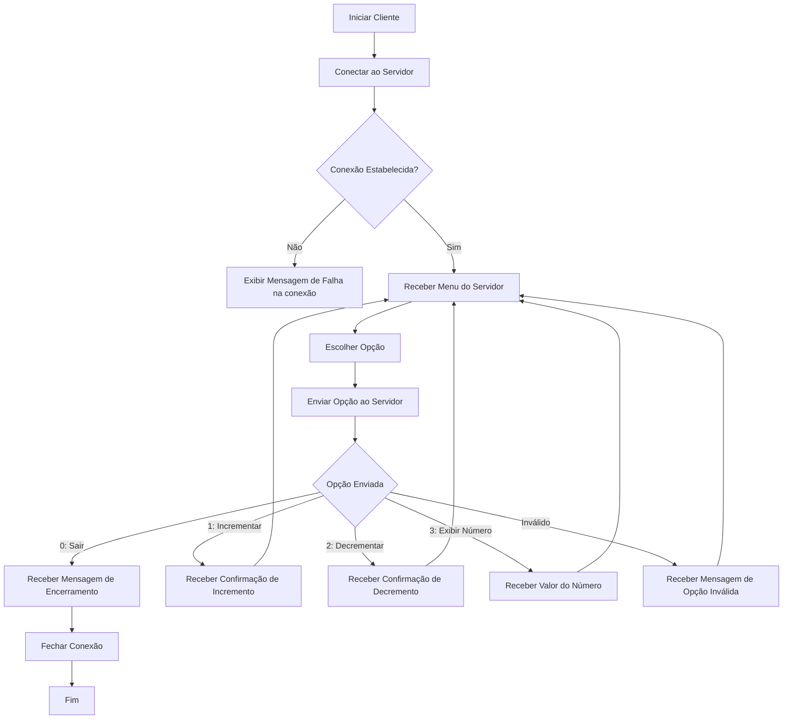

```c#
try
        {
            //configura o servidor e a porta
            string server = "127.0.0.1";
            int port = 13000;

            //conecta ao servidor
            TcpClient client = new TcpClient(server, port);

            // Obtém o stream para ler e escrever dados
            NetworkStream stream = client.GetStream();

            // Buffer para armazenar os dados recebidos do servidor
            byte[] buffer = new byte[256];
            int bytesRead;

            // Recebe e exibe o menu inicial do servidor
            bytesRead = stream.Read(buffer, 0, buffer.Length);
            string serverMessage = Encoding.UTF8.GetString(buffer, 0, bytesRead);
            Console.WriteLine(serverMessage);

```
