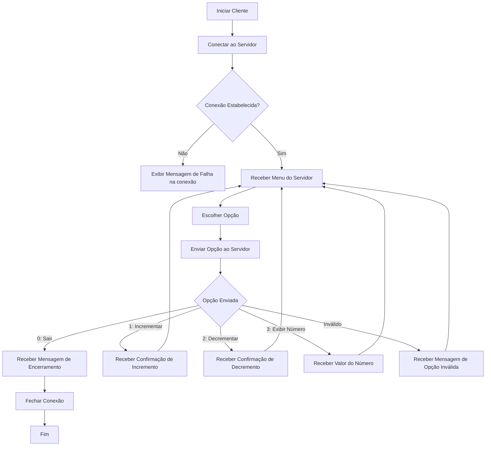

# Documentação do Projeto

## SharedMemoryClient
O projeto [SharedMemoryClient](./SharedMemoryClient/SharedMemoryClient/Program.cs) apresenta o código do Cliente que
que acessa o Servidor enviado na [Avaliação](https://github.com/lupamedeiros/pjd_redes/blob/main/aula_03).

O Fluxograma abaixo apresenta o comportamento do Código do Cliente



### Explicação do Código Utilizado

**Bibliotecas utilizadas no Projeto:**

```c#
using System;
using System.Net.Sockets;
using System.Text;

```

1. **Configuração Inicial**
```c#
 try
        {
            //configura o servidor e a porta
            string server = "127.0.0.1";
            int port = 13000;

            //conecta ao servidor
            TcpClient client = new TcpClient(server, port);

```
- **server**: Define o endereço IP do servidor como '127.0.0.1', que é o endereço do próprio computador (localhost).
- **port**: Define a porta para conexão como '13000'.
- **TcpClient client = new TcpClient(server, port);** : Cria uma nova instância de TcpClient e tenta conectar ao servidor no endereço e porta especificados.

2. **Comunicação com o Servidor**
```c#
            // Obtém o stream para ler e escrever dados
            NetworkStream stream = client.GetStream();

            // Buffer para armazenar os dados recebidos do servidor
            byte[] buffer = new byte[256];
            int bytesRead;

            // Recebe e exibe o menu inicial do servidor
            bytesRead = stream.Read(buffer, 0, buffer.Length);
            string serverMessage = Encoding.UTF8.GetString(buffer, 0, bytesRead);
            Console.WriteLine(serverMessage);
```
- **NetworkStream stream = client.GetStream();**: Obtém o 'NetworkStream' associado ao 'TcpClient', que será usado para enviar e receber dados.
- **byte[] buffer = new byte[256];** :  Cria um buffer de 256 bytes para armazenar os dados recebidos do servidor.
- **bytesRead = stream.Read(buffer, 0, buffer.Length);** : Lê os dados enviados pelo servidor e armazena no buffer. 'bytesRead' contém o número de bytes realmente lidos.
- **string serverMessage = Encoding.UTF8.GetString(buffer, 0, bytesRead);** : Converte os bytes recebidos em uma string usando a codificação UTF-8(a mesma utilizada no Servidor).
- **Console.WriteLine(serverMessage);** : Exibe a mensagem enviada pelo Servidor.

3. **Loop de Comunicação**
```c#
while (true)
{
    // Lê a opção do usuário
    string option = Console.ReadLine();

    // Envia a opção escolhida ao servidor
    byte[] data = Encoding.UTF8.GetBytes(option);
    stream.Write(data, 0, data.Length);

    // Recebe e exibe a resposta do servidor
    bytesRead = stream.Read(buffer, 0, buffer.Length);
    serverMessage = Encoding.UTF8.GetString(buffer, 0, bytesRead);
    Console.WriteLine(serverMessage);

    // Se a opção for 0 (Sair), encerra a conexão
    if (option == "0")
    {
        break;
    }
}

```
- **while(true)** : Inicia um loop infinito, mantendo a conexão ativa enquanto o cliente não decide sair.
- **string option = Console.ReadLine();** : Lê a opção digitada pelo usuário no console.
- **byte[] data = Encoding.UTF8.GetBytes(option);** : Converte a string 'option' para um array de bytes usando a codificação UTF-8.
- **stream.Write(data, 0, data.Length);** : Envia os bytes ao servidor através do 'NetworkStream'.
- **bytesRead = stream.Read(buffer, 0, buffer.Length);** : Aguarda e lê a resposta do servidor.
- **serverMessage = Encoding.UTF8.GetString(buffer, 0, bytesRead);** : Converte a resposta do servidor de bytes para string.
- **Console.WriteLine(serverMessage);** : Exibe a mensagem enviada pelo Servidor.
- **if (option == "0") {break;}** : Se a opção escolhida for "0", o loop é interrompido.

4. **Encerramento da Conexão**
```c#
// Fecha o stream e o cliente
            stream.Close();
            client.Close();
        }
        catch (SocketException e)
        {
            Console.WriteLine("SocketException: {0}", e);
        }
        catch (Exception e)
        {
            Console.WriteLine("Exception: {0}", e);
        }
        
        Console.WriteLine("\nPressione Enter para sair");
        Console.Read();
```
- **stream.Close();** e **client.Close();** : Fecha o 'NetworkStream' e o 'TcpClient', encerrando a conexão com o servidor.
- **catch (SocketException e)** e **catch (Exception e)** : Captura e exibe erros que podem ocorrer durante a conexão ou comunicação com o servidor.
- **Console.WriteLine("\nPressione Enter para sair");** : Exibe uma mensagem ao usuário, pedindo que aperte Enter para sair do programa.
- **Console.Read();** : Aguarda o Cliente apertar Enter para fechar a aplicação.