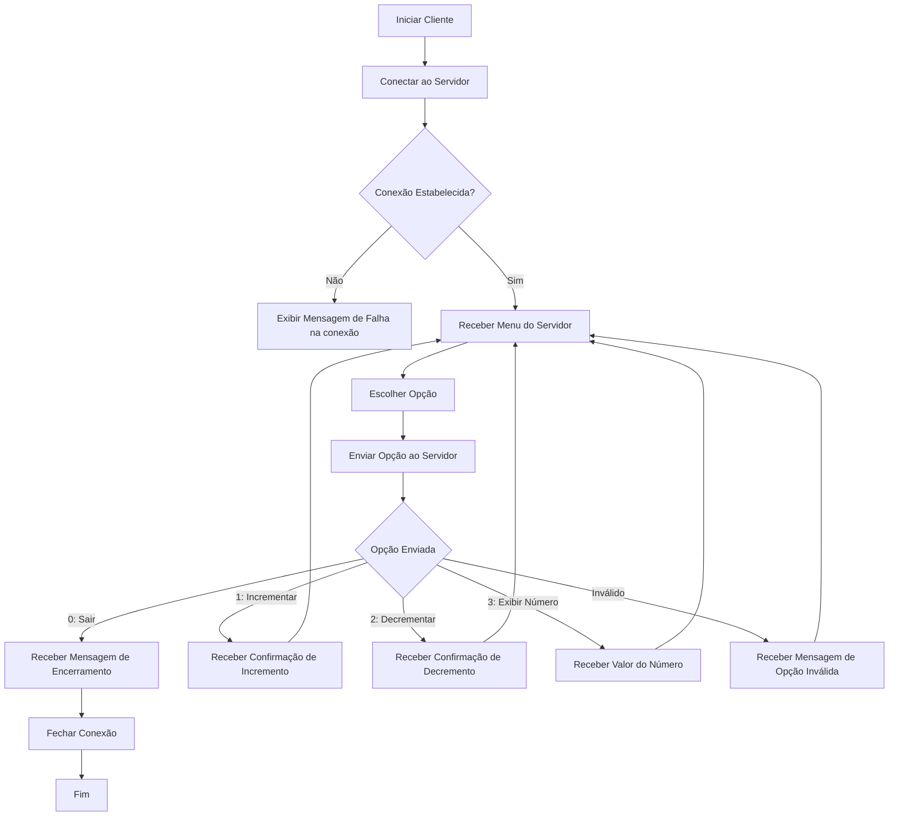

```mermaid
flowchart TD
    A["Iniciar Cliente"] --> B["Conectar ao Servidor"]
    B --> C{"Conexão Estabelecida?"}
    C -- Não --> D["Exibir Mensagem de Falha na conexão"]
    C -- Sim --> E["Receber Menu do Servidor"]
    E --> F["Escolher Opção"]
    F --> G["Enviar Opção ao Servidor"]
    G --> H{"Opção Enviada"}
    H -- 0: Sair --> I["Receber Mensagem de Encerramento"]
    H -- 1: Incrementar --> J["Receber Confirmação de Incremento"]
    H -- 2: Decrementar --> K["Receber Confirmação de Decremento"]
    H -- 3: Exibir Número --> L["Receber Valor do Número"]
    H -- Inválido --> M["Receber Mensagem de Opção Inválida"]
    I --> N["Fechar Conexão"]
    J --> E
    K --> E
    L --> E
    M --> E
    N --> O["Fim"]
```
